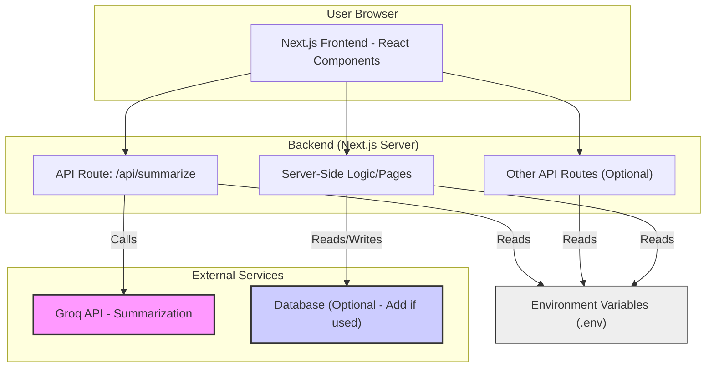

# Healthcare Dashboard

## Overview

A web application designed to visualize and analyze healthcare data. This dashboard provides insights into various healthcare metrics and leverages AI for summarizing relevant information.

## Features

*   **Data Visualization:** Interactive charts and graphs for exploring healthcare datasets.
*   **AI-Powered Summarization:** Utilizes the Groq API to summarize text data (e.g., patient notes, research papers).
*   **User-Friendly Interface:** Built with modern web technologies for a seamless user experience.
*   **(Add more specific features as applicable)**

## Technology Stack

*   **Frontend:** Next.js, React, TypeScript (likely), Tailwind CSS (common choice)
*   **Backend:** Next.js API Routes
*   **External APIs:** Groq API (for summarization)
*   **Package Manager:** npm or yarn

## Architecture

The application follows a standard Next.js architecture, separating frontend presentation logic from backend API handling. An external AI service (Groq) is integrated for specific functionalities like text summarization.



*   **Frontend:** Handles user interaction and presentation, built with React components within the Next.js framework.
*   **Backend API Routes:** Serverless functions handling specific tasks like data fetching or processing (e.g., `/api/summarize` which interacts with Groq).
*   **External Services:** Third-party APIs like Groq for specialized tasks.
*   **Environment Variables:** Securely stores configuration and API keys (like `GROQ_API_KEY`).

## Getting Started

Follow these instructions to set up and run the project locally.


### Installation

1.  **Clone the repository:**
    ```bash
    git@github.com:MunishMummadi/health-dashboard.git
    ```
2.  **Install dependencies:**
    ```bash
    npm install
    # or
    yarn install
    ```
3.  **Set up environment variables:**
    *   Create a `.env` file in the root of the project.
    *   Add the necessary environment variables. You will need at least:
        ```dotenv
        GROQ_API_KEY=your_groq_api_key_here
        # Add other variables as needed (e.g., DATABASE_URL)
        ```
    *   Obtain your Groq API key from the [Groq Console](https://console.groq.com/keys).

### Running the Application

1.  **Start the development server:**
    ```bash
    npm run dev
    # or
    yarn dev
    ```
2.  Open your browser and navigate to `http://localhost:3000` (or the specified port).

## API Routes

*   `/api/summarize`: Endpoint to handle text summarization requests using the Groq API.

## Contributing

Contributions are welcome! Please follow these steps:

1.  Fork the repository.
2.  Create a new branch (`git checkout -b feature/your-feature-name`).
3.  Make your changes.
4.  Commit your changes (`git commit -m 'Add some feature'`).
5.  Push to the branch (`git push origin feature/your-feature-name`).
6.  Open a Pull Request.

Please ensure your code follows the project's coding standards and includes tests where appropriate.

## License

This project is licensed under the MIT License - see the [LICENSE](LICENSE) file for details.
